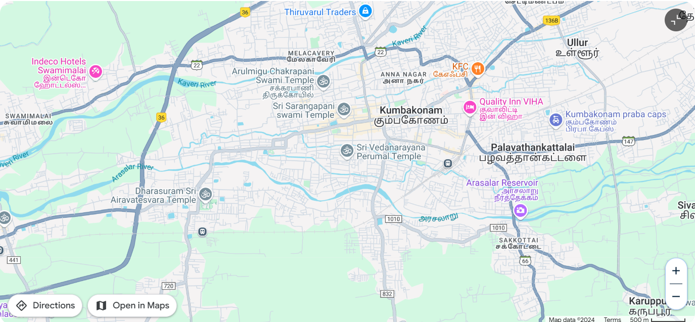

# Ex04 Places Around Me
## Date: 29.11.2024

## AIM
To develop a website to display details about the places around my house.

## DESIGN STEPS

### STEP 1
Create a Django admin interface.

### STEP 2
Download your city map from Google.

### STEP 3
Using ```<map>``` tag name the map.

### STEP 4
Create clickable regions in the image using ```<area>``` tag.

### STEP 5
Write HTML programs for all the regions identified.

### STEP 6
Execute the programs and publish them.

## CODE
'''
# 1.city:
<html>
    <head>
        My City
    </head>
    <body>
        <h1 align = "center">
            <font color="red"><b>Kumbakonam</b></font>
        </h1>
        <h3 align="center">
            <font color="blue"><b>Austin Aro (24900653)</b></font>
        </h3>
        <center>
            
            <map name="MyCity">
                <area shape="rect" coords="748,207,887,241" title="My Home town" href="home.html">
                <area shape="poly" coords="772,86,844,48,348,158,430,163" title="River" href="river.html">
                <area shape="circle" coords="1068,443,74" title="photo" href="photo.html">
                <area shape="rect" coords="538,204,695,232" title="Temple" href="temple.html">
                <area shape="rect" coords="220,367,431,400" title="Temple2" href="temple2.html">
            </map>
        </center>
    </body>
</html>

# 2.Home:
<html>
    <body style="background-color: antiquewhite;">
        <b>Kumbakonam</b> (formerly spelt as Coombaconum or Combaconum),[1] or 
        <b>Kudanthai</b>, is a city municipal corporation in the Thanjavur district in the Indian state of Tamil Nadu.
         It is located 40 km (25 mi) from Thanjavur and 282 km (175 mi) from Chennai and is the headquarters of the Kumbakonam taluk of Thanjavur district.
         It is the second largest city in the district after Thanjavur. The city is bounded by two rivers, the Kaveri River to the north and Arasalar River to the south.
         Kumbakonam is known as a "Temple town" due to the prevalence of a number of temples here and is noted for its Mahamaham festival, which happens once in 12 years, attracting people from all over the country.
<br><br>
        Kumbakonam dates back to the Sangam period and was ruled by the Early Cholas,
         Pallavas, Mutharaiyar dynasty, Medieval Cholas, Later Cholas, Pandyas, the Vijayanagara Empire,
          Madurai Nayaks, Thanjavur Nayaks and the Thanjavur Marathas.
          It rose to be a prominent town between the seventh and ninth centuries AD, when it served as a capital of the Medieval Cholas.
          The city reached the zenith of its prosperity during the British Raj when it was a prominent centre of European education 
          and Hindu culture; and it acquired the cultural name, the "Cambridge of South India".
          In 1866, Kumbakonam was officially constituted as a municipality, which today comprises 48 wards,
          making it the second largest local civil body in Thanjavur district.
          It became a municipal corporation on 24 August 2021.

    </body>
</html>

# 3.River:
<html>
    <body style="background-color: aqua;">
        The <b>Kaveri</b> (also known as <b>Cauvery</b>) is a major river flowing across Southern India.It is the third largest river in the region after Godavari and Krishna.
        The catchment area of the Kaveri basin is estimated to be 81,155 km2 (31,334 sq mi) and encompasses the states of Tamil Nadu, Karnataka, Kerala, and the union territory of Puducherry.<br><br>
The river rises at Talakaveri in the Brahmagiri range in the Western Ghats. The source is located at an elevation of 1,341 m (4,400 ft) in the Kodagu district of Karnataka.<br><br>
The river flows for about 320 km (200 mi) through the Deccan plateau in Karnataka before entering Tamil Nadu. It flows further eastward in Tamil Nadu for 416 km (258 mi) before flowing into the Bay of Bengal near Poompuhar in Mayiladuthurai district of Tamil Nadu.
The river flows for a total length of about 800 km (500 mi).<br><br>
The major tributaries include Amaravati, Arkavati, Bhavani, Hemavati, Kabini, Lakshmana Tirtha, and Noyyal.<br><br>
There are a number of dams on the river which form part of an extensive irrigation system and are used for the generation of hydroelectric power.
The river has supported agriculture for centuries and has served as the lifeline of several kingdoms in the past. Access to the river's waters has been a cause of dispute among the states of Karnataka and Tamil Nadu for decades.
The Kaveri basin is a densely populated region, with several towns and cities located on its banks.<br><br>
The river is considered as sacred by the people of Southern India and is considered to be among the seven holy rivers of India.
The river is often personified and worshiped as the goddess Kaveri. The river is mentioned in various Hindu religious texts including the Mahabharata and the Puranas.
In ancient Tamil literature, the river is referenced to as Ponni meaning "the golden one".<br><br>
    </body>
</html>

# 4.Photo:

<html>
    <body style="background-color: beige;">
        The river <b>Arasalar</b> is a river that flows through Tamil Nadu and Pudducherry, and a distributary of Kaveri river which splits into 5 different rivers when it enters into Thanjavur district from Trichy.
        It separates from river Kaveri in the place near Pullambadi where the Kaveri is stopped by Lower Anaicut and from Thiruvaiyaru.
        The river is one of the seven rivers that run in the Karaikal region of Puducherry.
    </body>
</html>

# 5.Temple:

<html>
    <body style="background-color: aquamarine;">
        The <b>Sarangapani Temple, Thirukudanthai, or Kumbakonam koyil</b> is a Hindu temple dedicated to Vishnu, located in Kumbakonam, Tamil Nadu, India.
        It is one of the Divya Desams, the 108 temples of Vishnu revered in Nalayira Divya Prabandham by the 12 poet saints, or Alvars.
        This temple is along Kaveri and is one of the Pancharanga Kshetrams.<br><br>
The temple is one of the Pancha Kshethram where the goddess Lakshmi was born as Bhargavi- the daughter of Maharishi Bhrigu.
The other four temples of the Pancha Kshethram are Sundararaja Perumal Temple, Salem, Oppiliappan temple, Nachiyar Koil and Venkateswara Temple, Tirumala.<br><br>
The temple is believed to be of significant antiquity with contributions at different times from Medieval Cholas, Vijayanagara Empire and Madurai Nayaks.
The temple is enshrined within a huge granite wall and the complex contains all the shrines and the water bodies of the temple.
The rajagopuram (the main gateway) has eleven tiers and has a height of 173 ft (53 m).
The Potramarai tank, the temple tank, is located opposite to the western entrance of the temple.<br><br>
Sarangapani is believed to have appeared for sage Hemarishi.
The temple has six daily rituals at various times from 5:30 a.m. to 9 p.m., and twelve yearly festivals on its calendar.
The temple chariot festival is the most prominent festival of the temple, celebrated during the Tamil month of Chittirai (March–April).
The twin temple chariots are the third-largest in Tamil Nadu, each weighing 300 t (660,000 lb).<br><br>
    </body>
</html>

# 6.Temple2:

<html>
    <body style="background-color: cyan;">
        <b>Airavatesvara Temple</b> is a Hindu temple of Chola architecture located in Kumbakonam, Thanjavur District in the South Indian state of Tamil Nadu.
        This temple, built by Chola emperor Rajaraja II in the 12th century CE is a UNESCO World Heritage Site, along with the Brihadeeswara Temple at Thanjavur, the Gangaikondacholisvaram Temple at Gangaikonda Cholapuram that are referred to as the Great Living Chola Temples.<br><br>
The Airavatesvarar temple is one among a cluster of eighteen medieval era large Hindu temples in the Kumbakonam area, Thanjavur District.The temple is dedicated to Shiva.
It also reverentially displays Vaishnavism and Shaktism traditions of Hinduism, along with the legends associated with Nayanmars – the Bhakti movement saints of Shaivism.<br><br>
The stone temple incorporates a chariot structure, and includes major Vedic and Puranic deities such as Indra, Agni, Varuna, Vayu, Brahma, Surya, Vishnu, Saptamatrikas, Durga, Saraswati, Sri devi (Lakshmi), Ganga, Yamuna, Subrahmanya, Ganesha, Kama, Rati and others.
Shiva's consort has a dedicated shrine called the Periya Nayaki Amman temple. This is a detached temple situated to the north of the Airavateshvarar temple.
This might have been a part of the main temple when the outer courts were complete.
At present, parts of the temple such as the gopuram is in ruins, and the main temple and associated shrines stand alone.
It has two sun dials namely morning and evening sun dials which can be seen as wheels of the chariot.
The temple continues to attract large gatherings of Hindu pilgrims every year during Magha, while some of the images such as those of Durga and Shiva are part of special pujas.<br><br>
    </body>
</html>

'''


## OUTPUT

1.

2.

3.

4.

5.

6.

## RESULT
The program for implementing image maps using HTML is executed successfully.
